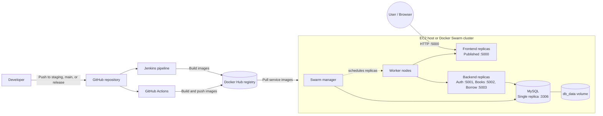
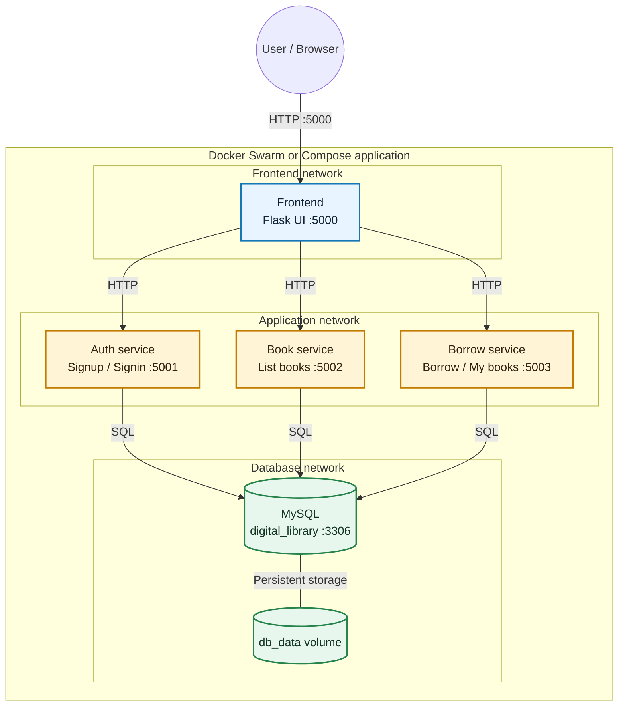

# Python Code Library App

A containerized digital library application for user authentication, browsing books, and tracking borrowed books. The application is implemented as small Python/Flask services and deployed with Docker Compose or Docker Swarm.

## Table of Contents

1. [Project Overview](#project-overview)
2. [Architecture](#architecture)
3. [Technology Stack](#technology-stack)
4. [Prerequisites](#prerequisites)
5. [Environment Configuration](#environment-configuration)
6. [Run Locally with Docker Compose](#run-locally-with-docker-compose)
7. [Deploy with Docker Swarm](#deploy-with-docker-swarm)
8. [Build and Publish Images](#build-and-publish-images)
9. [CI/CD](#cicd)
10. [Operations and Troubleshooting](#operations-and-troubleshooting)
11. [Contributing](#contributing)

## Project Overview

The frontend provides the user-facing library workflow:

- Sign up, sign in, and log out
- View the available books
- Borrow a book
- View previously borrowed books

The frontend communicates with internal services over Docker networks. The services share a MySQL database, while the database data is stored in the `db_data` Docker volume.

## Architecture

This project follows a containerized three-tier architecture. Source code is built into service images, published to Docker Hub, and deployed to an EC2 host or Docker Swarm cluster.

### Deployment Architecture



### Infrastructure Components

1. **Source and automation**
   - GitHub stores the application source and workflow configuration.
   - GitHub Actions builds and publishes the five Docker images.
   - Jenkins provides a parameterized `pilot` and `prod` deployment pipeline.
2. **Container registry**
   - Docker Hub stores the frontend, auth, book, borrow, and database images.
   - Deployment hosts pull images from the registry instead of depending on local images.
3. **Application runtime**
   - Docker Compose runs all services on a single host.
   - Docker Swarm schedules replicas across manager and worker nodes.
   - The frontend publishes port `5000`; backend ports remain internal.
4. **Data layer**
   - MySQL stores users, books, and borrow records in the `digital_library` database.
   - The `db_data` volume provides persistent database storage.

### Network Architecture

The Compose definition uses isolated overlay networks when deployed with Swarm:

- `frontend-network`: connects the published frontend to the runtime network.
- `app-network`: connects the frontend to `auth_service`, `book_service`, and `borrow_service`.
- `db-network`: connects backend services to the `db` MySQL service.

The frontend reaches backend services using Docker DNS names such as `auth_service:5001`. Backend services reach MySQL using `DB_HOST=db`. This keeps internal service traffic inside the Docker network and exposes only the frontend to users.

### Application Architecture



### Architecture at a Glance

```text
             User / Browser
                |
             HTTP :5000
                |
          +--------------v--------------+
          |       Frontend (Flask)      |
          |  Public: frontend-network  |
          +--------------+--------------+
                |
            Internal HTTP requests
                |
     +----------------------+----------------------+
     |                      |                      |
+-------v--------+   +---------v-------+   +----------v---------+
| Auth Service   |   | Book Service    |   | Borrow Service     |
| Signup/Signin  |   | List books      |   | Borrow/My books    |
| Port 5001      |   | Port 5002       |   | Port 5003          |
+-------+--------+   +---------+-------+   +----------+---------+
     |                      |                      |
     +----------------------+----------------------+
                |
                SQL / MySQL
                |
           +----------v----------+
           |   MySQL Database    |
           | digital_library     |
           | Internal port 3306  |
           +----------+----------+
                |
             db_data volume
             Persistent data

  app-network: Frontend <-> backend services
  db-network:  Backend services <-> MySQL
```

### Request Flow

1. A user opens the frontend on port `5000`.
2. The frontend sends internal HTTP requests to the auth, book, and borrow services.
3. Each backend service reads or writes data in the MySQL database.
4. MySQL stores its data in the `db_data` Docker volume so container recreation does not remove the database files.

Only the frontend port is published by `compose.yml`; backend services and MySQL communicate through internal Docker networks.

### Services

| Service | Directory | Responsibility | Port |
| --- | --- | --- | --- |
| `frontend` | `./` | Web UI and request routing | `5000` |
| `auth_service` | `./auth` | User signup and signin | `5001` |
| `book_service` | `./book` | Book listing | `5002` |
| `borrow_service` | `./borrow` | Borrow records and user books | `5003` |
| `db` | `./database` | MySQL persistence | `3306` |

The Compose file defines three overlay networks:

- `frontend-network`: frontend access
- `app-network`: frontend-to-service communication
- `db-network`: service-to-database communication

## Technology Stack

- Python 3.9
- Flask
- MySQL
- `mysql-connector-python`
- `requests`
- Docker and Docker Compose
- Docker Swarm overlay networking
- GitHub Actions
- Jenkins
- AWS EC2 deployment targets

## Prerequisites

Install the following tools on the development or deployment host:

- Git
- Docker Engine
- Docker Compose v2 (`docker compose`) or the legacy `docker-compose` command
- Docker Hub access for pulling and publishing images
- Docker Swarm enabled when using `docker stack deploy`

## Environment Configuration

Copy the template and provide environment-specific values:

```bash
cp .env.example .env.staging
```

Important variables:

| Variable | Purpose | Default |
| --- | --- | --- |
| `DB_IMAGE` | MySQL image | `sankalp2620/docker:db` |
| `AUTH_IMAGE` | Auth image | `sankalp2620/docker:auth` |
| `BOOK_IMAGE` | Book image | `sankalp2620/docker:book` |
| `BORROW_IMAGE` | Borrow image | `sankalp2620/docker:borrow` |
| `FRONTEND_IMAGE` | Frontend image | `sankalp2620/docker:frontend` |
| `DB_ROOT_PASSWORD` | MySQL root password | Required |
| `DB_USER` | Application database user | Required |
| `DB_PASSWORD` | Application database password | Required |
| `DB_NAME` | Database name | Required |
| `FRONTEND_PORT` | Published frontend port | `5000` |
| `FRONTEND_REPLICAS` | Frontend replica count | `3` |
| `SERVICE_REPLICAS` | Backend replica count | `3` |

Do not commit real passwords, SSH keys, or production credentials. Use `.env.staging` for staging and `.env.prod` for production.

## Run Locally with Docker Compose

From this directory, validate the Compose configuration and start the application:

```bash
docker compose --env-file .env.staging config
docker compose --env-file .env.staging up -d
docker compose ps
```

Open [http://localhost:5000](http://localhost:5000) in a browser. To stop the application:

```bash
docker compose --env-file .env.staging down
```

Use `docker-compose` instead of `docker compose` if the legacy Compose executable is installed.

## Deploy with Docker Swarm

Initialize a Swarm manager on the manager host:

```bash
docker swarm init
docker node ls
```

Run the join command printed by `docker swarm init` on each worker host:

```bash
docker swarm join --token <worker-token> <manager-ip>:2377
```

All nodes must be able to pull the images referenced by the environment file. Log in to Docker Hub on every node when the registry is private:

```bash
docker login
```

Export the environment values before deploying the stack. `docker stack deploy` reads Compose variable substitutions from the manager's environment:

```bash
set -a
source .env.staging
set +a
docker stack deploy --with-registry-auth -c compose.yml library
docker stack services library
docker stack ps library
```

The frontend is available at `http://<manager-ip>:${FRONTEND_PORT}`. Remove the stack with:

```bash
docker stack rm library
```

## Build and Publish Images

Build the five images from their Dockerfiles:

```bash
docker build -t sankalp2620/docker:db ./database
docker build -t sankalp2620/docker:auth ./auth
docker build -t sankalp2620/docker:book ./book
docker build -t sankalp2620/docker:borrow ./borrow
docker build -t sankalp2620/docker:frontend .
```

Authenticate and publish them to Docker Hub:

```bash
docker login
docker push sankalp2620/docker:db
docker push sankalp2620/docker:auth
docker push sankalp2620/docker:book
docker push sankalp2620/docker:borrow
docker push sankalp2620/docker:frontend
```

For repeatable releases, use immutable tags instead of relying only on `latest`.

## CI/CD

### GitHub Actions

The workflow in `.github/workflows/deploy.yml`:

1. Runs on pushes to `staging` or `main`, and on published releases.
2. Builds and pushes database, auth, book, borrow, and frontend images to Docker Hub.
3. Deploys to staging when the `staging` branch changes.
4. Deploys to production when a GitHub release is published.

Configure these repository secrets before enabling deployment:

- `DOCKER_USERNAME`
- `DOCKER_PASSWORD`
- `STAGING_EC2_HOST`, `STAGING_EC2_USER`, `STAGING_EC2_SSH_KEY`
- `PROD_EC2_HOST`, `PROD_EC2_USER`, `PROD_EC2_SSH_KEY`

Update `/path/to/app` in the workflow with the actual application directory on each EC2 host.

### Jenkins

`Jenkinsfile` provides a parameterized pipeline with `pilot` and `prod` deployment choices. It checks out the repository, builds the Docker images, runs the available pytest suite, performs a placeholder dependency scan, and deploys over SSH.

The Jenkins agent requires Docker, Compose, Python, pytest, and SSH access. Replace the placeholder server values and deployment path in `Jenkinsfile` with real infrastructure values. Production deployment pauses for manual approval.

## Operations and Troubleshooting

Inspect service state and logs:

```bash
docker compose ps
docker compose logs -f frontend
docker compose logs -f auth_service
```

For Swarm deployments:

```bash
docker stack services library
docker service ps library_frontend
docker service logs -f library_auth_service
```

Common checks:

- Confirm every image can be pulled from Docker Hub.
- Confirm `DB_HOST=db` and that the database service is named `db`.
- Confirm the database credentials and `DB_NAME` match the environment file.
- Confirm port `5000` is open on the host or EC2 security group.
- Confirm the Swarm manager and workers can communicate on ports `2377`, `7946`, and `4789`.
- Remember that removing the stack does not remove the named `db_data` volume.

## Contributing

1. Fork the repository.
2. Create a feature branch.
3. Make and test your changes.
4. Open a pull request with a clear description.

Run the test command before submitting changes:

```bash
python -m pytest -q
```

## Author

Maintained by [Sankalp2620](https://github.com/Sankalp2620).


