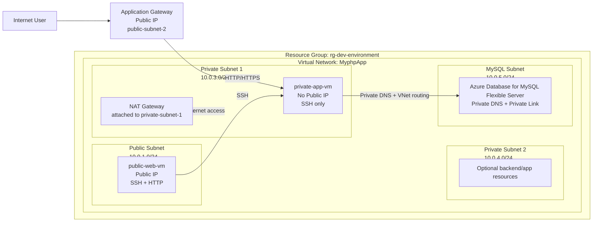

# Azure Infrastructure Setup with Terraform

This guide explains the Terraform-based steps to create the Azure infrastructure after cloning the repository.

## 1. Prerequisites

Before you begin, ensure the following are installed and available:

- Terraform
- Azure CLI
- Git
- An active Azure subscription
- Permission to create resources in the subscription

Check installation:

```bash
terraform version
az version
az login
```

If you are not logged in, run:

```bash
az login
az account set --subscription "<your-subscription-id>"
```

---

## 2. Clone the repository

```bash
git clone <repository-url>
cd <repository-folder>
```

Go to the Terraform directory:

```bash
cd Project-2/AzureInfrastructure/Dev
```

---

## 3. Review the Terraform configuration

The Terraform files in this folder include:

- `main.tf` - main infrastructure definition
- `variables.tf` - variables used by the configuration
- `terraform.tfvars` - actual values for deployment
- provider configuration and module references

Open the `terraform.tfvars` file and verify the values such as:

- resource group name
- location
- VNet name
- subnet ranges
- VM names and sizes
- NAT gateway name
- application gateway name
- database server name and credentials

Update the values as needed for your environment.

---

## 4. Initialize Terraform

Run:

```bash
terraform init
```

This downloads the required providers and modules.

---

## 5. Validate the configuration

Check syntax and configuration validity:

```bash
terraform validate
```

If there are errors, fix them before continuing.

---

## 6. Review the execution plan

Create a plan before applying changes:

```bash
terraform plan
```

This will display the resources Terraform intends to create, update, or delete.

Review:

- resource group
- virtual network and subnets
- network interfaces
- public and private VMs
- NAT gateway
- application gateway
- database resources

---

## 7. Create the Azure infrastructure

Apply the Terraform configuration:

```bash
terraform apply
```

If you want to skip confirmation prompts:

```bash
terraform apply -auto-approve
```

Terraform will start creating the Azure resources.

---

## 8. Check the created resources in Azure

After deployment completes, verify in Azure Portal or using Azure CLI:

```bash
az resource list --resource-group rg-dev-environment -o table
```

You can also inspect the Terraform output values if they are defined in the configuration.

---

## 9. Useful Terraform commands

### Re-run after changes

```bash
terraform plan
terraform apply
```

### Refresh state

```bash
terraform refresh
```

### Destroy infrastructure

If you want to delete the environment:

```bash
terraform destroy
```

Or:

```bash
terraform destroy -auto-approve
```

---

## 10. Important notes

- Azure resource names must be globally unique.
- Always confirm the subscription and region before deployment.
- Review VM sizes and quotas to avoid quota-related failures.
- If a database name or server name already exists in Azure, update the value in `terraform.tfvars`.
- Keep sensitive values such as passwords in secure storage or environment variables when possible.

---

## 11. Azure architecture topology



### Architecture summary

- Public VM is placed in the public subnet and has a public IP.
- Private VM is placed in a private subnet and does not have a public IP.
- Application Gateway sits in the public subnet and routes traffic to the private application VM.
- NAT Gateway is attached to the private subnet for outbound internet access.
- Azure Database for MySQL is created in a dedicated delegated subnet and accessed privately through VNet DNS.

---

## 12. Recommended deployment flow

Use this sequence for each deployment:

```bash
terraform init
terraform validate
terraform plan
terraform apply -auto-approve
```

This is the standard flow to create the Azure infrastructure from the repository.
